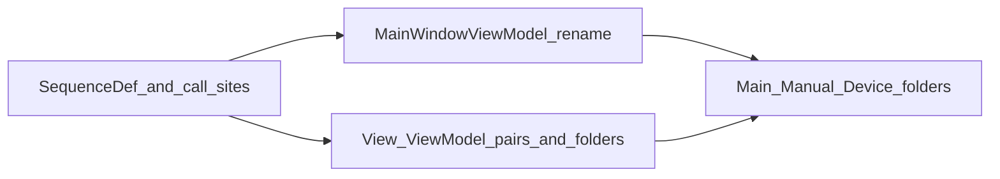

# PLAN: HMI·시퀀스 실행 계획 (백로그)

| 항목 | 내용 |
|------|------|
| 목적 | 대화에서 합의한 HMI 구조·시퀀스 상수화·리팩터를 **단계별**로 추적한다. |
| 규약·네이밍 | [CONVENTIONS_Hmi_Sequences.md](CONVENTIONS_Hmi_Sequences.md) |
| 동작 스펙 | [SPEC_UI_Hmi.md](SPEC_UI_Hmi.md), [SPEC_Sequence_Engine.md](SPEC_Sequence_Engine.md) |

이 문서는 **아직 코드에 전부 반영되지 않은** 작업 순서를 담는다. 구현 시 이 표를 기준으로 PR/커밋을 나누면 된다.

---

## 단계별 백로그

| 단계 | 내용 |
|------|------|
| **A** | `Vcd.Contracts`에 `Define/SequenceDef.cs` 추가: 그래프 정의 id(`AutoMain`, `Semi_LoadAndBond`) 및 등록 스텝 id(`Step_PreFlightChecks`, `Step_NoOp`)를 `public const string`으로 단일화한다. |
| **A′** | C# 호출부를 상수로 치환: `SequenceHostController`, `Step_PreFlightChecks`, `Step_NoOp`, `SequenceManagerTests`; 테스트 프로젝트에 `Vcd.Contracts` 참조 추가. **`sequences/**/*.json`의 `"id"` 및 `step` 노드 문자열은 그대로 두되, 값은 반드시 `SequenceDef`와 동일**하게 유지한다 (JSON은 빌드 타임에 C# 상수를 참조할 수 없음). |
| **B** | 셸 네이밍: `MainShellViewModel` → `MainWindowViewModel`; `MainWindow.xaml` / `MainWindow.xaml.cs`와 타입·바인딩 정합. |
| **C** | 패널: `DeviceView` ↔ `DeviceViewModel` 등 `*View` / `*ViewModel` 쌍으로 통일; `ViewModels/` 폴더를 없애고 View와 동일한 디렉터리 트리(또는 기능별 하위 폴더)에 ViewModel을 둔다. |
| **D** | 폴더 구조(점진 적용): `Views/Main/`(예: `EquipmentStatusView`), `Views/Manual/{Motor,Robot,Plc}/`, `Views/Device/`(디바이스별 설정 UserControl). `ManualView`는 서브 영역 + 자식 ViewModel 조율. |
| **E** | ViewModel 스타일(현장 디버깅 우선): `App.*` 등 공통 참조는 생성 시 **필드에 캐시**한 뒤 클래스 내부에서는 필드만 사용; 바인딩 프로퍼티는 `{ get; set; }` 본문 + `ObservableObject.SetProperty`; 생성자는 `InitXxx()` 파사드만 호출; `#region`으로 변수 / 초기화 / 바인딩 프로퍼티 / 명령 / 장비·PLC 동기화 등을 구분. CommunityToolkit.Mvvm은 **`[RelayCommand]` 등 명령 위주**로 유지. |
| **F** | XAML: 루트에 `d:DataContext="{d:DesignInstance Type=…ViewModel, IsDesignTimeCreatable=…}"`로 디자인 타입을 지정해 바인딩 인텔리센스·정의로 이동을 보강한다 (DI가 있는 ViewModel은 `IsDesignTimeCreatable=False`). |
| **G** | 매뉴얼 시퀀스: 정의 id에 **`Manual_` 접두**; `sequences/manual/motor|robot|plc/` 등 도메인별 하위 폴더. 새 id는 `SequenceDef`에 상수 추가 후 JSON·C#을 맞춘다. |
| **보류** | **DevExpress Navigation Bar** — 라이선스·스택 이슈로 채택 보류. 순수 WPF 하단 내비·탭·토글 + `DataTemplate`로 유지. |

---

## 의존 관계

- **A → A′** 순서 권장 (상수 정의 후 치환).
- **B**와 **C**는 A′와 **병행 가능** (서로 다른 파일).
- **D**는 **B·C**로 타입·경로가 안정된 뒤 점진 적용이 수월하다.
- **E·F**는 새·이전 ViewModel을 손볼 때마다 적용하면 된다.
- **G**는 시퀀스 파일·`SequenceDef` 확장과 함께 진행.

---

## Change History

| Date | Summary |
|------|---------|
| 2026-04-01 | Code: A/A′·StartAsync·SequenceDef (별 PR). 이후 B–D·F·G 일부 반영 — `MainWindowViewModel`, `*ViewModel` co-location, `Views/Main|Device|Manual/...`, `d:DesignInstance`, `sequences/manual/plc/Manual_NoOp.json`, `SequenceDef.Manual_NoOp`. E는 `MainWindowViewModel`·`DeviceViewModel` 등에 부분 적용; 나머지 VM은 점진적. |
| 2026-04-01 | Initial plan from HMI·sequence documentation baseline. |
