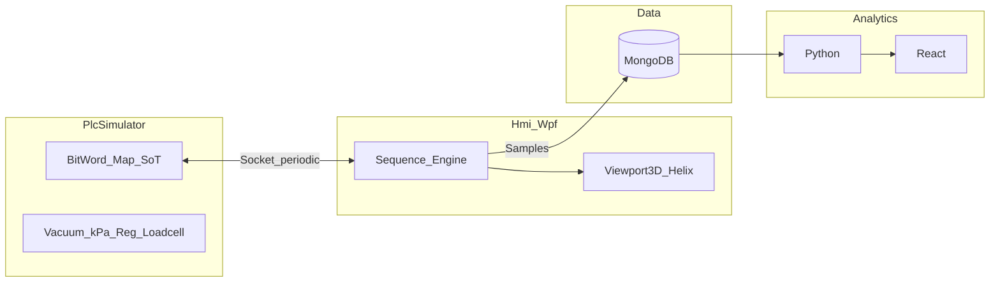

# PRD: 필름 합착 시뮬레이터 (Lamination Equipment Simulator)

| 항목 | 내용 |
|------|------|
| 문서 버전 | 1.2 |
| 최종 수정 | 2026-03-31 |
| 관련 SPEC | [SPEC_Control_IO.md](SPEC_Control_IO.md), [SPEC_Sequence.md](SPEC_Sequence.md), [SPEC_Layout_Recipe.md](SPEC_Layout_Recipe.md), [SPEC_Architecture_Solution.md](SPEC_Architecture_Solution.md), [SPEC_Sequence_Engine.md](SPEC_Sequence_Engine.md), [SPEC_Model_Flow.md](SPEC_Model_Flow.md), [SPEC_Interlocks.md](SPEC_Interlocks.md), [SPEC_Logging_Csv.md](SPEC_Logging_Csv.md), [SPEC_Motion_SpiiPlus.md](SPEC_Motion_SpiiPlus.md), [SPEC_UI_Hmi.md](SPEC_UI_Hmi.md), [TECH_STACK.md](TECH_STACK.md), [ROADMAP.md](ROADMAP.md) |

---

## 1. 배경·목적

- **목적**: 취업용 포트폴리오 — 제조 설비(HMI·시퀀스·I/O·이력·분석)를 end-to-end로 설명 가능한 시뮬레이터.
- **도메인**: 기존 **.NET** 역량 유지; **데이터 분석·시각화**는 **Python**으로 확장 학습.
- **비범위(명시)**: 실제 **비전 알고리즘·카메라 처리**는 구현하지 않음. 정렬은 **가상 결과(ΔX, ΔY, Δθ)** 로 시뮬.

---

## 2. 용어

| 용어 | 의미 |
|------|------|
| **CGO** | 상부 자재(필름) |
| **OCA** | 하부 자재(필름) |
| **합착** | 상·하 자재를 챔버에서 압력·진공 조건 하에 접합하는 공정(본 시뮬에서 **약 2초** 구간) |
| **UVW** | 하부 정밀 스테이지(3축); 실제는 비전 보정 후 보간 제어 — 본 프로젝트는 **가상 보정값** 반영 |
| **ESC Chuck** | 정전기 척; 전압 설정으로 자재 고정(맵 상 **워드/비트**로 모델링) |
| **박리** | OCA 등 **하부 필름**의 박리 동작; 로봇 팔의 **진공면**과 반대측 **그립퍼**로 수행 |
| **Ready** | 로봇·챔버 등 **안전 대기 위치**(모든 로봇 이동은 Ready 경유) |

---

## 3. 제품 개요

데스크톱 **WPF HMI**가 운전·시퀀스를 수행하고, 별도 **PLC 시뮬레이터**와 **소켓**으로 Bit/Word 맵을 주기 교환한다. 합착 구간의 공정 데이터는 DB에 기록되고, **Python + React(로컬 웹)** 로 이력·트렌드를 조회한다.

---

## 4. 기구·레이아웃(요약)

- **셀 크기**: 가로 **2 m** × 세로 **2 m** × 높이 **2.5 m** (상세 좌표·티칭은 [SPEC_Layout_Recipe.md](SPEC_Layout_Recipe.md)).
- **좌측**: 상·하 **챔버**(합착 발생 구역, ESC·레귤레이터·로드셀 개념).
- **우측 하단**: **상부 스테이지 / 하부 스테이지** 2구(자재 로드).
- **우측 중앙~상단**: **로봇** — 기구는 다관절로 **표현** 가능하나, 제어·애니메이션은 **단순화: X, Y, θ (갠트리식)**.

---

## 5. 사용자·시나리오(요약)

1. 레시피(모델) 선택·자재·티칭값 확인.
2. PLC 시뮬 가동 후 **Start** 등 명령으로 자동 시퀀스 시작.
3. HMI에서 진공·펌프·로봇·챔버 상태를 실시간 확인; **3D 뷰**에서 다각도 확인(카메라 궤도·줌·팬).
4. 합착 2초 구간 데이터가 DB에 쌓임.
5. 웹 대시보드에서 **디바이스별 / 공정 이력별** 2초 추이 확인.

---

## 6. 기능 요구사항

### 6.1 제어·통신

- **진실(Source of truth)**: 모든 상태값(자재 유무, 진공 도달, 압력, 알람 등)의 **권위는 PLC 시뮬 맵**에 둔다.
- **WPF**: 시퀀스 실행, 조작, **DO 출력**(진공·펌프·로봇 트리거 등), 맵 **주기 모니터링**.
- **PLC 시뮬**: WPF DO·워드를 읽어 **가상 설비** 반응(펌프, 챔버 kPa, 레귤레이터·로드셀, DI 갱신).
- **교환 방식**: **TCP 소켓**, **주기적 맵 스냅샷**(구현 세부는 [SPEC_Control_IO.md](SPEC_Control_IO.md)).

### 6.2 공정(논리 순서, 요약)

초기: Low/High 스테이지에 필름 로드, 스테이지 진공 On. 이후 대략:

- 로봇이 **하부 스테이지(OCA)** Pick(로봇 그립 진공 On → 스테이지 진공 Off 핸드오프); 이후 **Ready 경유** 후 상부 챔버에 **CGO** 안착 시나리오 등 ([SPEC_Sequence.md](SPEC_Sequence.md)와 맵 심볼로 정합).
- **Ready 경유** 후 상부 챔버 안착; 상부 **진공 + ESC** On, 로봇 진공 Off.
- 하부 **박리**(그립퍼 Grip/Ungrip, 공정 설정으로 **SkipPeel** 가능).
- Ready 후 **UVW 가상 보정**, 상·하 챔버 **합착 위치** 이동.
- **진공 펌프** 등으로 챔버 **kPa** 조건 후 **2초 합착**; 레귤레이터·로드셀 트렌드 기록.
- 원위치 후 합착체를 로봇으로 **하부 스테이지**에 배치, **Ready 경유**, 사이클 종료.

*(상세 상태 전이: [SPEC_Sequence.md](SPEC_Sequence.md))*

### 6.3 데이터

- 합착 구간 **짧은 주기**(예: 0.1 s) 샘플 **연속 저장** — 저장소로 **MongoDB** 등 비관계형을 전제(구현 단계에서 스키마 확정).
- 대시보드: **Python** 백엔드(또는 스크립트) + **React** 프론트, 로컬 웹.

### 6.4 HMI·3D

- **레시피 화면**: 모델별 티칭·ESC·재료 두께·SkipPeel 등([SPEC_Layout_Recipe.md](SPEC_Layout_Recipe.md)).
- **3D**: WPF `Viewport3D` + **Helix Toolkit** 권장; **궤도·줌·팬**; 로봇 pose는 **X,Y,θ(mm, deg)** 보간 반영.
- **펌프·진공·스테이지 센서** 등 상태 표시는 맵 바인딩.

### 6.5 인터록·안전

- 도어, E-Stop, 진공 미달 등은 **점진적으로** 시퀀스 구현과 함께 추가한다(초기 PRD는 원칙만 명시).
- **Vent·대기압**, **펌프 On = 양 챔버 Bond**, **축 간 기구 인터락**은 [SPEC_Control_IO.md](SPEC_Control_IO.md)·[SPEC_Interlocks.md](SPEC_Interlocks.md)에 반영.

### 6.6 시퀀스·모델·모션 (후속)

- **시퀀스 엔진**: Manual/Semi/Auto 그래프, `parallel`/`ref`, 오토 시작 **프리플라이트**(Ready·스테이지 진공) — [SPEC_Sequence_Engine.md](SPEC_Sequence_Engine.md).
- **모델 주입**: `IModelFlowDescriptor` — [SPEC_Model_Flow.md](SPEC_Model_Flow.md).
- **SPiiPlus 모듈**: Active/Deactivate, 버퍼9 `ON_MONITORING_FLAG`, JobQueue, Timeout — [SPEC_Motion_SpiiPlus.md](SPEC_Motion_SpiiPlus.md).
- **CSV 로그**: 레시피 폴더 하위 `Logs`, 보관 최대 14일, 메인 로그 버튼 — [SPEC_Logging_Csv.md](SPEC_Logging_Csv.md).
- **HMI**: 다크 셸, 하단 메뉴, 매뉴얼 I/O·티칭·레시피 — [SPEC_UI_Hmi.md](SPEC_UI_Hmi.md).

---

## 7. 비기능 요구

| 항목 | 목표 |
|------|------|
| 압력 단위 | **kPa** (스케일은 SPEC 참조) |
| 실시간성 | HMI 폴링 **50~200 ms** 수준(튜닝) |
| 재현성 | 레시피·맵 버전·사이클 ID로 이력 추적 |
| 확장 | 모델별 레시피 전환; 추후 챔버·IO 확장 가능한 맵 여유 영역 |

---

## 8. 위험·가정

- 실제 기구와의 mm 단위 일치는 **티칭 테이블**로 조정; 초안 좌표는 SPEC에 예시값.
- 소켓 프로토콜·정확한 워드 수는 구현 시 고정 프레이밍·Endian 문서화 필요.

---

## 9. 문서 이력

| 버전 | 일자 | 내용 |
|------|------|------|
| 1.0 | 2026-03-31 | 초안 통합 |
| 1.1 | 2026-03-31 | 후속 SPEC 링크·Vent/인터락/시퀀스/로그/UI 요약 |
| 1.2 | 2026-03-31 | TECH_STACK·ROADMAP 링크 추가 |
