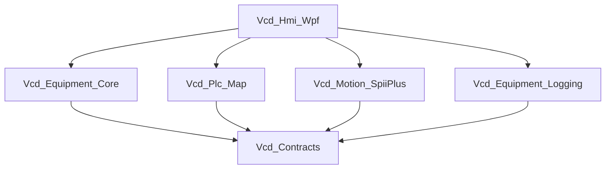

# SPEC: 솔루션·모듈 아키텍처

| 항목 | 내용 |
|------|------|
| 관련 PRD | [PRD_Lamination_Simulator.md](PRD_Lamination_Simulator.md) |

---

## 1. 프로젝트 맵 (권장)

| 프로젝트 | 역할 |
|----------|------|
| `Vcd.Contracts` | 공용 DTO, 옵션, 예외(선택). UI/Infra 의존 없음. |
| `Vcd.Equipment.Core` | 시퀀스 엔진, 인터락, 레시피 저장소 **인터페이스**, `EquipmentSnapshot` 빌더 연동 지점. WPF 미참조. |
| `Vcd.Equipment.Logging` | CSV 오류/이력 로그, 보관 정리. |
| `Vcd.Plc.Map` | I/O 맵 스냅샷, 소켓 클라이언트(또는 인메모리 시뮬). |
| `Vcd.Motion.SpiiPlus` | SPiiPlus 연결, 버퍼9, JobQueue, `IMotionGateway` + `IMotionCommands`. (SDK 없을 때 Stub) |
| `Vcd.Hmi.Wpf` | MVVM, 뷰, `IDialogService`, DI 호스트(`Microsoft.Extensions.Hosting` 권장). |

---

## 2. 모듈 수명주기

```csharp
public interface IEquipmentModule
{
    string ModuleId { get; }
    bool IsActive { get; }
    Task ActivateAsync(CancellationToken cancellationToken = default);
    Task DeactivateAsync(CancellationToken cancellationToken = default);
}
```

- **PLC**, **Motion(SpiiPlus)** 각각 `IEquipmentModule` 구현.
- **Deactivate**: 폴링 중지, 큐 드레인, 연결 해제, (모션) `ON_MONITORING_FLAG=0` 등 — [SPEC_Motion_SpiiPlus.md](SPEC_Motion_SpiiPlus.md).

---

## 3. 의존성 방향



- **Core**는 **구체 드라이버**를 참조하지 않는다. `IIoMapClient`, `IMotionGateway` 등 **인터페이스**는 Core 또는 Contracts에 정의.

---

## 4. 리포지토리 뼈대 (현재)

- 솔루션: [src/Vcd.slnx](../src/Vcd.slnx) (Visual Studio / `dotnet build Vcd.slnx`).
- 타깃 프레임워크: 라이브러리 `net10.0`, HMI `net10.0-windows` (로컬 SDK에 맞게 조정 가능).
- 프로젝트 참조: `Hmi.Wpf` → Contracts, Equipment.Core, Equipment.Logging, Plc.Map, Motion.SpiiPlus; 나머지 라이브러리 → Contracts.

---

## 5. 구현 단계 (요약)

1. Contracts + Core 인터페이스·그래프 실행기 뼈대  
2. Plc.Map 인메모리 → 소켓  
3. Motion.SpiiPlus Stub → 실제 SDK 교체  
4. Logging CSV + 보관  
5. Hmi 조립

---

## 6. 변경 이력

| 일자 | 내용 |
|------|------|
| 2026-03-31 | 초안 |
| 2026-03-31 | src/Vcd.slnx 및 프로젝트 참조 뼈대 추가 |
