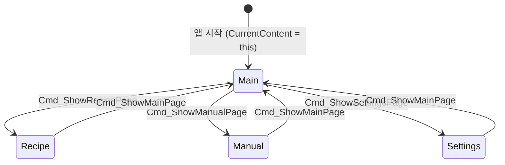
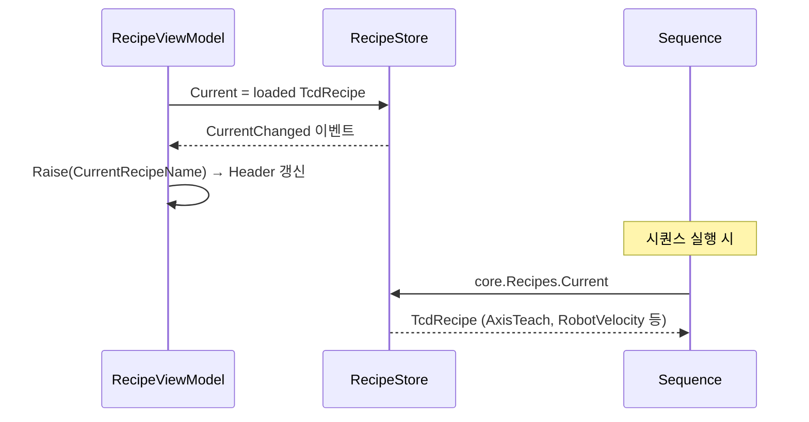

# SPEC — UI 구조 및 레시피 저장/불러오기

## 1. 전체 View 계층

```
MainWindow (WindowStyle=None, Maximized)
├── Header  — 타이틀 / CurrentRecipeName / Status
├── ContentPresenter  — CurrentContent (DataTemplate 자동 라우팅)
│     ├── MainView          ← DataContext: MainWindowViewModel
│     ├── RecipeView        ← DataContext: RecipeViewModel
│     ├── ManualView        ← DataContext: ManualViewModel
│     └── SettingsView      ← DataContext: SettingsViewModel
└── Footer  — 네비게이션 버튼 (Main / Recipe / Manual / Settings / Exit)
```

DataTemplate 매핑은 `MainWindow.xaml` Window.Resources 에 선언됨.
ViewModel 타입만 일치하면 WPF가 자동으로 대응되는 View를 렌더링한다.

```xml
<!-- MainWindow.xaml:25 -->
<DataTemplate DataType="{x:Type local:MainWindowViewModel}">
    <local:MainView DataContext="{Binding}" />
</DataTemplate>
```

---

## 2. 네비게이션 흐름

`MainWindowViewModel.CurrentContent` 를 교체하면 화면이 전환된다.



`MainWindowViewModel.cs:247~256` — 각 커맨드는 `CurrentContent` 를 해당 ViewModel 인스턴스로 교체한다.

---

## 3. ViewModel ↔ View 대응표

| ViewModel             | View           | 파일 위치                                     |
| --------------------- | -------------- | ----------------------------------------- |
| `MainWindowViewModel` | `MainView`     | `Tcd.App/MainView.xaml`                   |
| `RecipeViewModel`     | `RecipeView`   | `Tcd.App/View/Recipe/RecipeView.xaml`     |
| `ManualViewModel`     | `ManualView`   | `Tcd.App/View/Manual/ManualView.xaml`     |
| `SettingsViewModel`   | `SettingsView` | `Tcd.App/View/Settings/SettingsView.xaml` |

---

## 4. MainView 레이아웃

```
┌─────────────────────────────────────────────────────────────┐
│  [Materials]     │  EquipmentDiagramView  │  [Sequence Btns] │
│  Stage1/2        │  (HMI 개략도)          │  Load Stage      │
│  Upper/Lower     │                        │  Start / Stop    │
│                  │                        │  완제품 제거      │
│  [Devices]       │                        │  Clear           │
│  Robot 위치/진공  │                        │                  │
│  Axes 현재 위치  │                        │                  │
├──────────────────┴────────────────────────┤                  │
│  [Alarms / Log]  (ColSpan=2, 하단 전체)  │                  │
└──────────────────────────────────────────┴──────────────────┘
```

- **Materials / Devices**: `MainWindowViewModel.RefreshSnapshot()` 이 200ms 타이머로 갱신 (`MainWindowViewModel.cs:73`)
- **EquipmentDiagramView**: `IsBonding`, `RobotHasVacuum`, `*HasMaterial` 바인딩으로 애니메이션
- **Alarms / Log**: `SequenceManager.Trace` 이벤트 + `AlarmManager.AlarmRaised` 이벤트 → `Alarms` 컬렉션 prepend

---

## 5. RecipeView 레이아웃

```
┌──────────────┬──────────────────────────────────────────────┐
│  [Recipes]   │  [Editor]                                     │
│  (ListBox)   │  Name: __________                             │
│  레시피 목록  │  ┌─ Motor ─────────┬─ Robot ───────────────┐ │
│              │  │ U / V / W       │ Home          ___%     │ │
│              │  │ Z Load / Z Bond │ Ready         ___%     │ │
│              │  │ Velocity        │ S1_PickupWait ___%     │ │
│              │  │ Acc / Dec / Jerk│ ...                    │ │
│              │  └─────────────────┴────────────────────────┘ │
│              │                                               │
├──────────────┴──────────────────────────────────────────────┤
│  [Reload]  [New]  [Save]  [Save As...]   Status: ________   │
└─────────────────────────────────────────────────────────────┘
```

- **좌측 ListBox**: `RecipeViewModel.RecipeNames` 바인딩, 선택 시 `SelectedRecipeName` setter → `LoadSelected()` 자동 호출
- **Motor 탭**: 축 티칭 5개 + 모션 파라미터 4개 — 모두 `string` 필드로 바인딩 후 저장 시 `ParseDouble()` 변환
- **Robot 탭**: `RobotVelocityRows` (ObservableCollection) → `ItemsControl` 으로 렌더링

---

## 6. 레시피 저장/불러오기 구조

### 클래스 관계

```
MainCore (singleton)
├── RecipeStore          — 메모리 내 현재 레시피 상태
│     ├── Current        — 현재 선택된 TcdRecipe (시퀀스에서 참조)
│     └── CurrentChanged — UI에 변경 알림 이벤트
└── IRecipeRepository    → JsonRecipeRepository
      └── RecipesDirectory: %AppData%\TCD\Recipes\
```

### 데이터 모델 계층

```
TcdModel (1)
  └── TcdRecipe (N)
        ├── AxisTeach      : Dictionary<string, double>  (U/V/W/ZLower/ZUpper)
        ├── RobotTeach     : Dictionary<string, RobotPosition>
        ├── RobotVelocity  : Dictionary<string, int>     (포지션별 속도 %)
        ├── MotionVelocity : double
        ├── MotionAcc/Dec/Jerk : double
        └── TeachPositions : List<TeachPosition>
```

`TeachPosition` 은 이름이 붙은 다축 포지션 (U/V/W/ZLower/ZUpper + Velocity/Acc).
현재는 `TcdRecipe.TeachPositions` 필드로 존재하나 UI 편집 탭은 미구현.

### 파일 저장 방식

| 항목 | 내용 |
|---|---|
| 형식 | JSON (들여쓰기 포함, UTF-8) |
| 위치 | `%AppData%\TCD\Recipes\{Name}.json` |
| 구현 | `JsonRecipeRepository` (`Tcd.App/Core/RecipeRepository.cs`) |
| Enum 직렬화 | `JsonStringEnumConverter` 적용 (문자열로 저장) |

### 저장/불러오기 흐름

```mermaid
flowchart TD
    A([앱 시작]) --> B[MainCore.Initialize]
    B --> C[JsonRecipeRepository 생성\n%AppData%\\TCD\\Recipes]
    C --> D{파일 존재?}
    D -- 없음 --> E[Default.json 자동 생성]
    D -- 있음 --> F[전체 파일 로드 → RecipeStore]
    E --> F
    F --> G[RecipeStore.Current = 첫 번째 레시피]

    H([Recipe 탭 진입]) --> I[Reload: ListRecipeNames]
    I --> J[ListBox 갱신]
    J --> K{항목 선택}
    K --> L[LoadSelected: repo.Load\n → RecipeStore.Current 갱신\n → Editor 필드 바인딩]

    M([Save 버튼]) --> N[BuildFromEditor\n편집 필드 → TcdRecipe]
    N --> O[repo.Save → {Name}.json 덮어쓰기]
    O --> P[RecipeStore.Current 갱신\nReload 호출]

    Q([Save As 버튼]) --> R[BuildFromEditor\n이름 중복 시 _Copy 접미사]
    R --> S[repo.Save → 새 파일 생성]
    S --> P
```

### 레시피 선택 → 시퀀스 참조 흐름



---

## 7. 주요 파일 참조

| 파일 | 역할 |
|---|---|
| `Tcd.App/MainWindow.xaml` | 최상위 윈도우, DataTemplate 매핑, 레이아웃 골격 |
| `Tcd.App/MainWindowViewModel.cs` | 네비게이션 커맨드, UI 타이머, 시퀀스 실행 진입점 |
| `Tcd.App/MainView.xaml` | Main 탭 HMI 레이아웃 |
| `Tcd.App/View/Recipe/RecipeView.xaml` | 레시피 편집 UI |
| `Tcd.App/View/Recipe/RecipeViewModel.cs` | 레시피 CRUD 로직 |
| `Tcd.App/Core/Recipes.cs` | `TcdModel`, `TcdRecipe`, `RecipeStore` 데이터 모델 |
| `Tcd.App/Core/RecipeRepository.cs` | JSON 파일 저장/불러오기 구현 |
| `Tcd.App/Core/TeachPosition.cs` | 다축 이름 포지션 모델 |
| `Tcd.App/Core/MainCore.cs` | 컴포지션 루트, 초기화 순서 |
