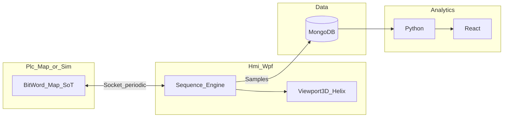

# Technology Stack

| Item | Content |
|------|---------|
| Document | Single source for **what we build with** |
| Related | [PRD_Lamination_Simulator.md](PRD_Lamination_Simulator.md), [SPEC_Architecture_Solution.md](SPEC_Architecture_Solution.md), [ROADMAP.md](ROADMAP.md) |

---

## Summary Table

| Area | Technology |
|------|------------|
| Runtime / language | **.NET**, **C#** (solution: `net10.0`, WPF: `net10.0-windows`) |
| HMI | **WPF**, **MVVM**, custom chrome (`WindowStyle=None`), **WPF Fluent** theme (.NET 9+ style) |
| 3D (optional) | `Viewport3D` + **Helix Toolkit** |
| PLC I/O | **TCP socket**, periodic Bit/Word map — [SPEC_Control_IO.md](SPEC_Control_IO.md); project `Vcd.Plc.Map` |
| Motion | **ACS SPiiPlus** / MMI, buffer contract — [SPEC_Motion_SpiiPlus.md](SPEC_Motion_SpiiPlus.md); project `Vcd.Motion.SpiiPlus` (stub without SDK) |
| Sequence / interlocks | In-house engine (JSON `sequence` / `parallel` / `ref`), `InterlockService` — [SPEC_Sequence_Engine.md](SPEC_Sequence_Engine.md), [SPEC_Interlocks.md](SPEC_Interlocks.md); `Vcd.Equipment.Core` |
| Recipe | **JSON**, default root `D:\VCD_Recipe` — [SPEC_Layout_Recipe.md](SPEC_Layout_Recipe.md) |
| File log | **CSV** under `{RecipeRoot}\Logs`, retention cap **14 days** — [SPEC_Logging_Csv.md](SPEC_Logging_Csv.md); `Vcd.Equipment.Logging` |
| Process history DB | **MongoDB** (high-rate lamination samples) — PRD 6.3 |
| Analytics UI | **Python** + **React**, local web — PRD |
| Shared contracts | `Vcd.Contracts` |
| Coding standards | [DEVELOPMENT_GUIDELINES.md](DEVELOPMENT_GUIDELINES.md) |
| Third-party UI | **DevExpress**: not in baseline; optional later (e.g. grid) |
| Vision | **Out of scope**; alignment via **virtual** ΔX, ΔY, Δθ only — PRD |

---

## Data Flow (high level)

---

## Solution Layout

See [SPEC_Architecture_Solution.md](SPEC_Architecture_Solution.md) and [src/Vcd.slnx](../src/Vcd.slnx).

---

## Change History

| Date | Summary |
|------|---------|
| 2026-03-31 | Initial TECH_STACK |
